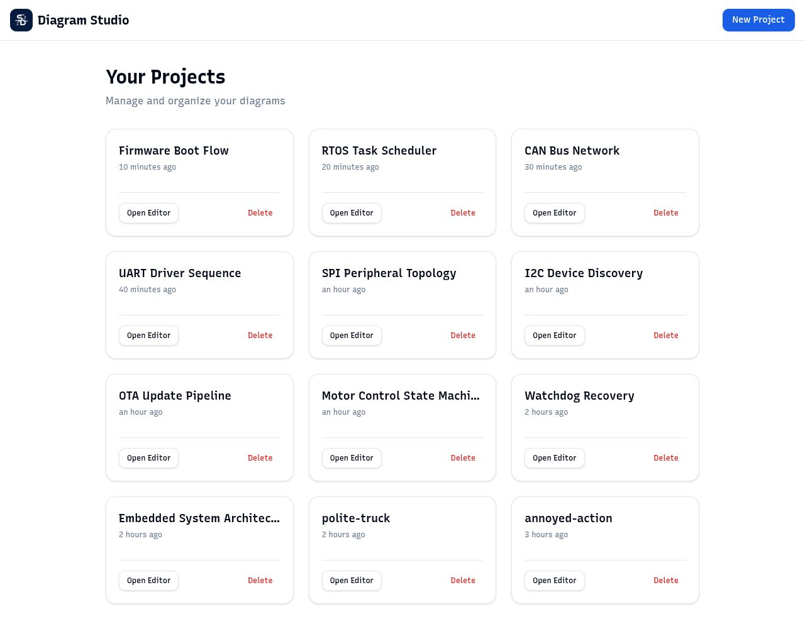
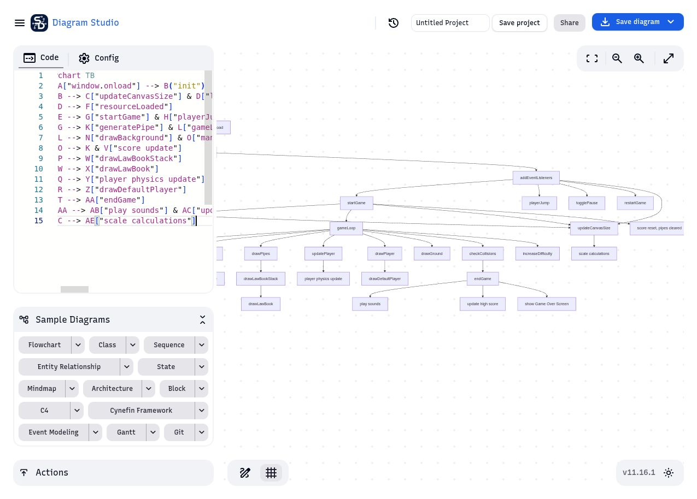

<p align="center">
  
</p>

# Diagram Studio

Diagram Studio is a self-hostable, open-source Mermaid editor for people who
want a focused workspace they control. It keeps the familiar Mermaid editing
experience while removing the surrounding premium-service promotions and
external calls-to-action that are not needed for creating diagrams.

Unlike a hosted editor tied to another service, you can run Diagram Studio on
your own domain, behind your own password, and with your own storage. Named
projects and diagram history live in the deployment volume, so the same private
workspace can be reached from different devices and browsers. There is no
artificial project limit: you can create as many projects as your deployment’s
storage and compute resources support.

The goal is simple: a Mermaid-based diagram studio without promotional links,
with privacy, portability, and self-hosting as first-class features.

<details open>
<summary><strong>Features</strong></summary>

- Edit and preview flowcharts, sequence diagrams, Gantt charts, and more in real time.
- Export diagrams directly as PNG or SVG files.
- Manage named projects from a deployment-backed dashboard.
- Start with ten embedded-systems examples for firmware design work.
- Protect the workspace with a configurable password.
- Share viewer or editor links when you explicitly choose to share a diagram.
- Customize the domain, renderer settings, logo, theme, and deployment environment.

</details>

<details open>
<summary><strong>Screenshots</strong></summary>

### Project dashboard

<p align="center">
  
</p>

### Diagram editor

<p align="center">
  
</p>

</details>

<details>
<summary><strong>Self-hosting and privacy</strong></summary>

You are free to download this repository, modify it, and deploy your own copy.
Each deployment can use its own domain, renderer settings, logo, theme, and
password. Authenticated project history and named diagrams are stored in the
deployment’s persistent data volume, not only in an individual browser. This
lets you access your workspace privately from anywhere while keeping control of
the hosting environment and data lifecycle.

The editor does not show Mermaid Pro, Mermaid Chart, or other promotional
redirects in the workspace. Renderer or Kroki requests are only made when you
explicitly use an export or integration link.

### Password protection

The production image serves a custom login page and protects the workspace
with a signed, server-side session. Set both the username and password as
deployment secrets; do not commit either value to the repository.

For a local Docker deployment:

```bash
docker build -t diagram-studio .
docker run --detach --name diagram-studio \
  --publish 8080:8080 \
  --volume diagram-studio-data:/data \
  --env DIAGRAM_STUDIO_AUTH_USER="choose-a-username" \
  --env DIAGRAM_STUDIO_PASSWORD="choose-a-password" \
  diagram-studio
```

For Fly.io, use runtime secrets:

```bash
fly secrets set DIAGRAM_STUDIO_AUTH_USER="choose-a-username" --app your-app-name
fly secrets set DIAGRAM_STUDIO_PASSWORD="choose-a-password" --app your-app-name
fly deploy
```

The server stores history in `/data/history.json`. Mount `/data` to a
persistent volume in production so projects survive restarts and redeploys.

</details>

<details>
<summary><strong>Docker</strong></summary>

Build the image yourself so you control the password and deployment settings.

### To configure renderer URL

When building set the MERMAID_RENDERER_URL build argument to the rendering
service.
Example:
Default is`https://mermaid.ink`.
Set to empty string to disable PNG and SVG links under Actions

### To configure Kroki Instance URL

When building set the MERMAID_KROKI_RENDERER_URL build argument to your Kroki
instance.
Default is `https://kroki.io`
Set to empty string to disable Kroki link under Actions

### To configure Analytics

When building set the MERMAID_ANALYTICS_URL build argument to your plausible instance, and MERMAID_DOMAIN to your domain.

Default is empty, disabling analytics.

### Development

```bash
docker compose up --build
```

Then open http://localhost:3000

### Building and running images locally

#### Build

```bash
docker build -t diagram-studio .
```

#### Run

```bash
docker run --detach --name diagram-studio --publish 8080:8080 \
  --volume diagram-studio-data:/data \
  --env DIAGRAM_STUDIO_AUTH_USER="choose-a-username" \
  --env DIAGRAM_STUDIO_PASSWORD="choose-a-password" \
  diagram-studio
```

Visit: <http://localhost:8080>

#### Stop

```bash
docker stop diagram-studio
```

</details>

<details>
<summary><strong>Setup and development</strong></summary>

Below link will help you making a copy of the repository in your local system.

https://docs.github.com/en/get-started/quickstart/fork-a-repo

## Requirements

- [Node.js](https://nodejs.org/en/) current LTS version
- [pnpm](https://pnpm.io/) package manager. Install with `corepack enable pnpm`

## Development

```sh
pnpm install
pnpm dev -- --open
```

This app is created with Svelte Kit.

</details>

<details>
<summary><strong>Project scope</strong></summary>

Diagram Studio is an independent self-hosted project built on Mermaid’s open
source editor foundations. It is not an official Mermaid Pro or Mermaid Chart
service. Its purpose is to provide a private, portable editor without premium
promotional UI, while preserving Mermaid diagram creation and export workflows.

</details>
